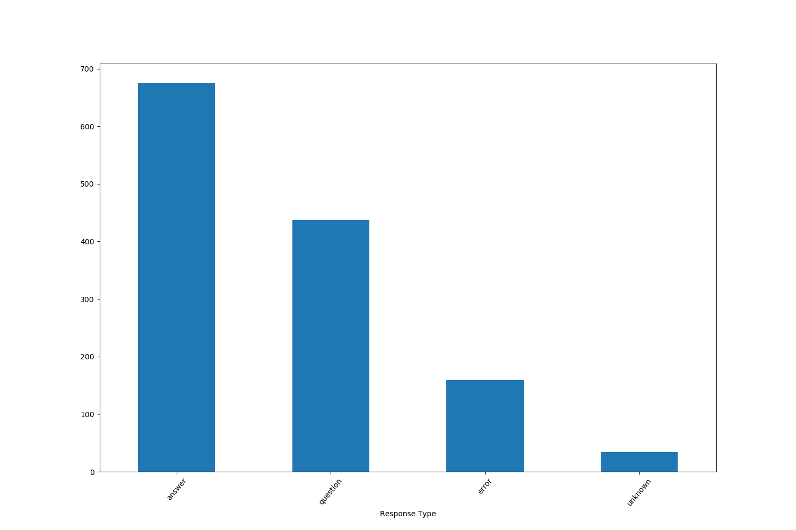
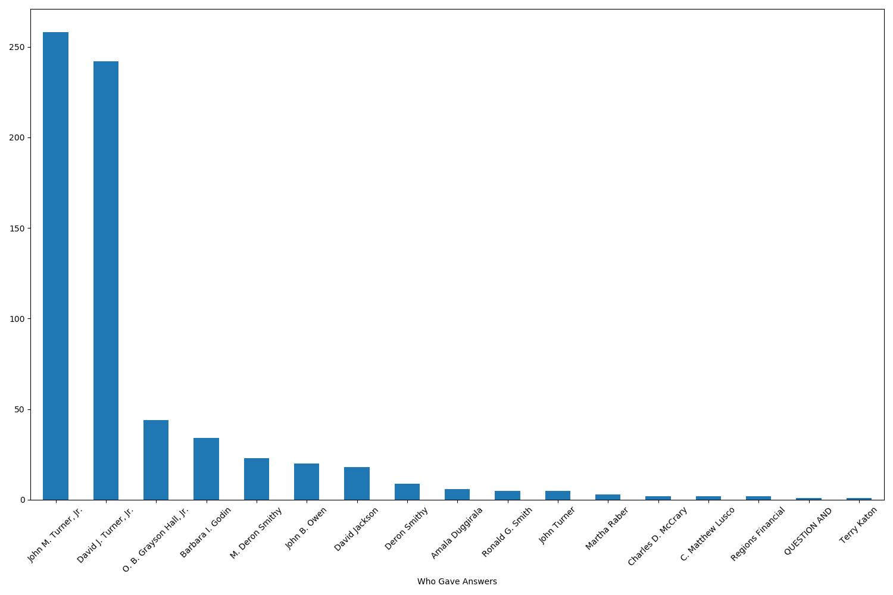
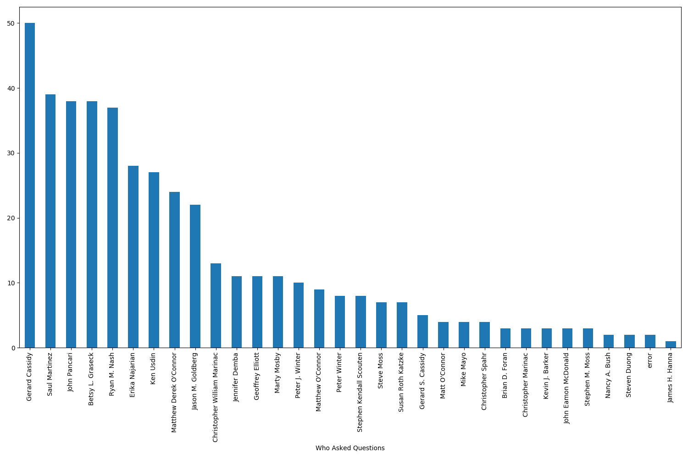
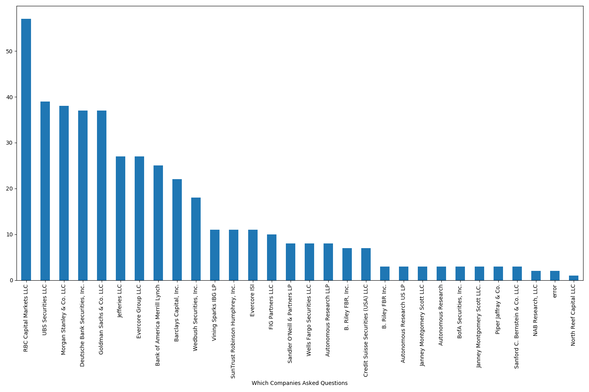

# BankNLP
In this project, I will be taking publicly available banking data and developing a word embedding model with appropriate weights. Publicly available data include quarterly presentations to investors and sec filings.

## Steps
1) Set up git
2) Set up python environment in anaconda using standard packages like numpy and pandas and also install any non-typical packagaes I might use like\
https://github.com/greedo/python-xbrl for xblr parsing\
pdftotext for taking in PDF files[^1]\
tabula-py for taking in table data
3) Download a selection of data and set up directory structure
4) Started coding in different files and then unifying some of the files using functions (putting original files in an folder labeled old). Make sure to comment what each function performs and do comments along the way
5) I focused first on looking at transcripts for Regions banks both quarterly report calls and other events. I wanted to have a good source of data with some labels I could play with to show some descriptive stats

[^1]: I tried PyPDF2 but it was inserting odd newline characters, and I tried tika but it relied too much on outside servers before I decided on pdftotext (which took a little extra work installing but seems much better overall)

## Some Results
I took transcripts from January 1 2018 to January 20th 2020 and tried to pull relevant information. The parsing I did unfortunately is relatively specific to how regions formatted its pdf. However, the broad intuition would be the same to read in other transcripts. I developed a dataframe of results that included the person who game the response, their title, their company, the type of response, the response itself, the type of document, the bank in question, and the filename of the file it was pulled from. This should ensure that if when running the script, there were systematic errors showing up you could see which files were giving the errors. A csv of the dataframe is given in [./data/QandA.csv]

The following are some figures to quickly visualize the data by what typse of questions are in the dataset, who is answering the questions, who is asking the questions, and what companies are asking questions.

