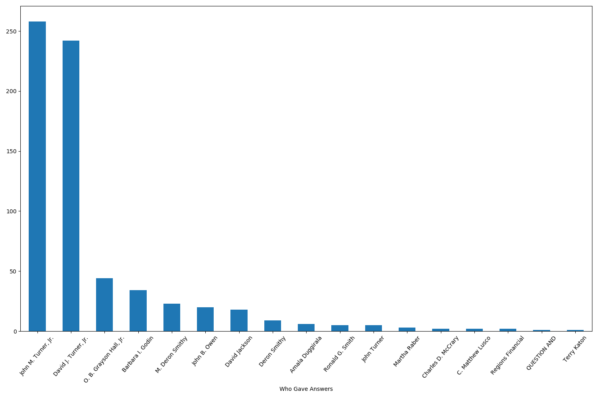
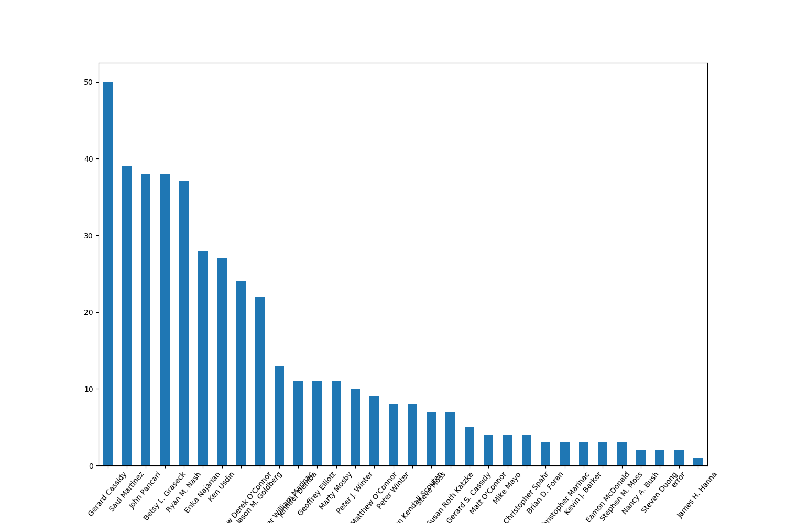
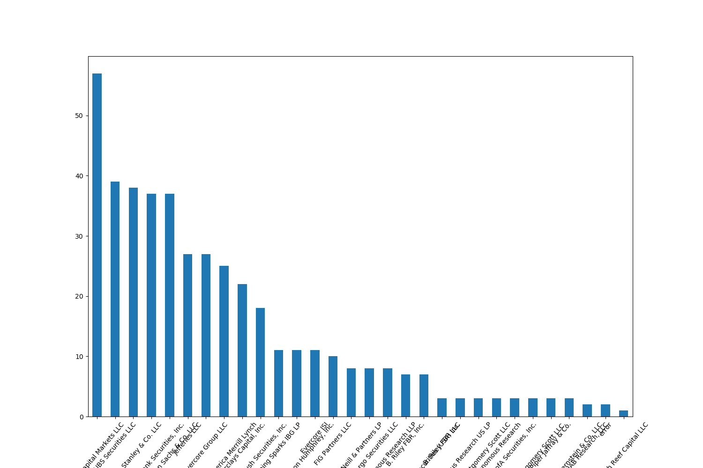

# BankNLP
In this project, I will be taking publicly available banking data and developing a word embedding model with appropriate weights. Publicly available data include quarterly presentations to investors and sec filings.

## Steps
1) Set up git
2) Set up python environment in anaconda using standard packages like numpy, matplotlib, and pandas and also install any non-typical packages I might use like\
https://github.com/greedo/python-xbrl for xblr parsing\
pdftotext for taking in PDF files[^1]\
tabula-py for taking in table data\
pytablewriter for writing markdown tables (for this document)
3) Download a selection of data and set up directory structure
4) Started coding in different files and then unifying some of the files using functions (putting original files in an folder labeled old). Make sure to do effective commenting of what each function performs and other comments along the way where there could be confusion.

[^1]: I tried PyPDF2 but it was inserting odd newline characters, and I tried tika but it relied too much on outside servers before I decided on pdftotext (which took a little extra work installing but seems much better overall)

For my process, I focused first on reading in the pdf files and making sure I was getting text and tables that were usable. Next I focused in on the transcripts for Regions banks both quarterly report calls and other events. I wanted to have a good source of textual data that also had labels that I could parse. This allows me to show some descriptive stats and do simple NLP. I worked to get the transcripts into a dataframe that would be usable for any bank as the end goal would be to ingest transcript information for many publicly traded banks with available analyst calls.

## Some Results
I took transcripts (and other published data) from Regions Bank over the period from January 1 2018 to January 20th 2020 and tried to pull relevant information. The parsing I did unfortunately is relatively specific to how regions formatted its pdf. However, the broad intuition would be the same to read in other transcripts. I developed a dataframe of results that included the person who gave the response, their title, their company, the type of response, the response itself, the type of document, the bank in question, and the filename of the file it was pulled from. This should ensure that if when running the script, there were systematic errors showing up you could see which files were giving the errors. A csv of the dataframe is given in [QandA.csv](./data/QandA.csv)

#### Tables
The following provides descriptive statistics for the entire dataframe

|      |responsetype| response |       name        | title |        company        | bank  |doctype|                            filename                             |
|------|------------|----------|-------------------|-------|-----------------------|-------|-------|-----------------------------------------------------------------|
|count |1305        |1305      |1146               |1146   |1146                   |1305   |1305   |1305                                                             |
|unique|           4|      1161|                 49|     35|                     32|      1|      2|                                                               19|
|top   |answer      |Thank you.|John M. Turner, Jr.|Analyst|Regions Financial Corp.|regions|qr     |../data/other/transcript\regions_Investor-Day-2019-Transcript.pdf|
|freq  |675         |21        |258                |434    |666                    |1305   |744    |129                                                              |

Note that this shows us there are some replies that aren't very helpful like "Thank you" and some are not as helpful due to the lack of variation in the current dataset like the bank column.

#### Figures
These figures quickly visualize the data by what types of questions are in the dataset, who is answering the questions, who is asking the questions, and what companies are asking questions.

Note this quickly shows us things like relative frequency of names and companies that show up. It also shows that some names are probably the same person but the transcript has coded them differently. For example, Matthew O'Conner shows up 3 different ways. It is important to decide if this matters.

Without getting good data to start we will have bad conclusions at the end. Garbage in Garbage out.
