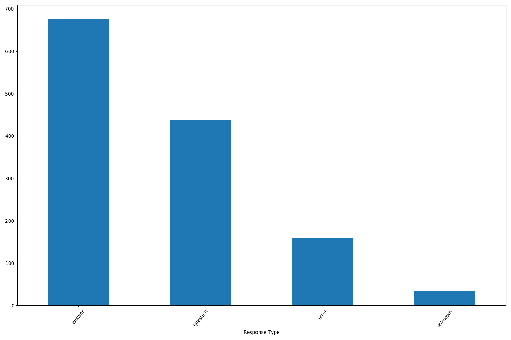
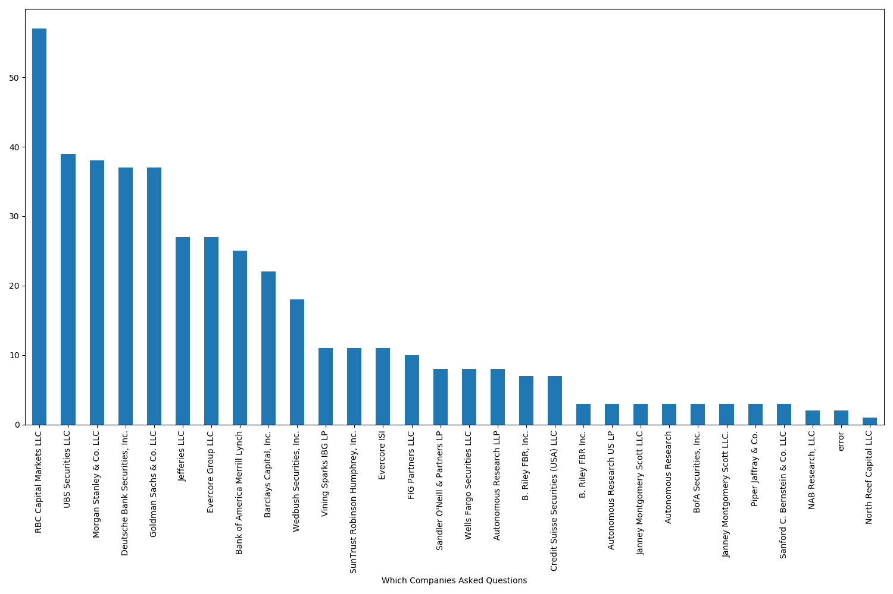

# BankNLP
In this project, I will be taking publicly available banking data, parsing it to get it into a useable format, showing some descriptive statistics, and finally developing a word embedding model. Publicly available data include quarterly presentations to investors and sec filings. Specifically, I will be focusing on publicly available Regions bank information over the past two years. This document walks through an edited version of my thought process. Please see [setup.md](setup.md) for specific setup instructions to run independently.

## Steps
1) Set up git
2) Set up python environment in anaconda using standard packages like numpy, matplotlib, and pandas and also install any non-typical packages I might use like\
https://github.com/greedo/python-xbrl for xblr parsing\
pdftotext for taking in PDF files1\
tabula-py for taking in table data\
pytablewriter for writing markdown tables (for this document)\
nltk and gensim for Word2Vec modeling
3) Download a selection of data and set up directory structure
4) Started coding data ingestion starting with different .py files and then unifying some of the files into a helper .py file using various functions (putting the original files in an folder labeled old). Make sure to do effective commenting of what each function performs and other comments along the way where there could be confusion.
5) Set up automated bulk ingestion of the pdfs and automated descriptive statistics to take a first look at the data and see any glaring errors.
6) Used gensim and nltk to create a word2vec model and visualize using an embedding projector through tensorflow

[1]: I tried PyPDF2 but it was inserting odd newline characters, and I tried tika but it relied too much on outside servers before I decided on pdftotext (which took a little extra work installing but seems much better overall)

For my process, I focused first on reading in the pdf files and making sure I was getting text and tables that were usable. Next, I focused in on the transcripts for Regions banks both quarterly report calls and other events. I wanted to have a good source of textual data that also had labels that I could parse. This allows me to show some descriptive stats and do simple NLP. I worked to get the transcripts into a generic dataframe structure that would be usable for any bank. The end goal would be to ingest transcript information for any publicly traded banks and use the same functions to immediately be able to ingest that information and draw conclusions.

## Some Results
I took transcripts (and other published data) from Regions Bank over the period from January 1 2018 to January 20th 2020 and pulled relevant information using string and regex functions. The parsing I did unfortunately is relatively specific to how regions formatted its pdf. However, the broad intuition would be the same to read in other transcripts. I developed a dataframe of results that included the person who gave the response, their title, their company, the type of response, the response itself, the type of document, the bank in question, and the filename of the file it was pulled from. It also perserved data that was not ingested correctly and noted it. This ensures that if when running the script, there were systematic errors showing up you could see which files were giving the errors by matching it to the filename.2 A csv of the dataframe is given in [QandA.csv](output/QandA.csv)

[2] For example in this process it turns out some of the transcripts from specific events were encoded slightly differently and thus gave errors that could be corrected in a finalized product.

#### Tables
The following provides descriptive statistics for the entire dataframe

|      |responsetype| response |       name        | title |        company        | bank  |doctype|                            filename                             |
|------|------------|----------|-------------------|-------|-----------------------|-------|-------|-----------------------------------------------------------------|
|count |1305        |1305      |1146               |1146   |1146                   |1305   |1305   |1305                                                             |
|unique|           4|      1161|                 49|     35|                     32|      1|      2|                                                               19|
|top   |answer      |Thank you.|John M. Turner, Jr.|Analyst|Regions Financial Corp.|regions|qr     |../data/other/transcript\regions_Investor-Day-2019-Transcript.pdf|
|freq  |675         |21        |258                |434    |666                    |1305   |744    |129                                                              |

Note that this shows us there are some replies that aren't very helpful like "Thank you" and some columns are not helpful at all (for the moment) due to the lack of variation in the current dataset. For example, the bank column is completely unnecessary at the moment, though it would be key as more banks are loaded into the database.

#### Figures
These figures quickly visualize the data by what types of questions are in the dataset, who is answering the questions, who is asking the questions, and what companies are asking questions.

Note this quickly shows us things like relative frequency of names and companies that show up. It also shows that some names are probably the same person but the transcript has coded them differently. For example, Matthew O'Conner shows up 3 different ways. It is important to decide if this matters. We also see the companies graph is very similar to the names graph suggesting that generally there is only one analyst asking questions for each company and perhaps companies is a better way to slice the data.

In general, without getting good data to start we will have bad conclusions at the end. Garbage in Garbage out. Ingesting the data aka [data munging](https://en.wikipedia.org/wiki/Data_wrangling) into a consistent format will allow the downstream analysis to proceed seamlessly if done well.

## NLP using Word2Vec
Next, I wanted to start with unsupervised learning of responses using the google Word2Vec algorithm (implemented in gensim). Essentially, this algorithm tries to embed a word in a vector space (where the size of the vector is a hyperparamter to be chosen) such that it is close to words that are similar to it. Even more specifically, there are two types of models. 
1) Continuous bag of words tends to be faster and more accurate with larger corpuses. It takes a ranger of words around a specific word and then tries to adjust weights on these words such that the model cn predict the word that is not included.
2) Skip gram tends to work better with smaller corpuses (this corpus is considered small at the moment) and does better when words do not show up much. In this context the model takes one word and tries to predict the words that would show up in context around this word.

When trained well word2vec can create vectors such that not only are like words near each other but vector addition and subtraction works intuitively. The common example given is something like "king"-"man" = "queen". In other words the vector king subtracting the vector man would get you close to the vector queen. With small amounts of data this is harder to realize in practice.

Each model can be visualized using the tensorflow projector. There are links to my models rendered in the projector below. Each can be explored nicely. It allows you to: See words that are similar. See words in 3d. See words using different dimensionality reduction algorithms like T-SNE and PCA. Make the data more sperical. Etc. It is also possible to manually create graphical representations through python with specific terms for inclusion in a PDF for example. However, I think the interactivity of these models is quite illustrative.
1) [CBOW](http://projector.tensorflow.org/?config=https://raw.githubusercontent.com/anahlik/BankNLP/master/output/model/CBOWvisual.json)

2) [SkipGram](http://projector.tensorflow.org/?config=https://raw.githubusercontent.com/anahlik/BankNLP/master/output/model/SGRAMvisual.json)

As an illustration of what these models are showing, take the following example: In the **sgram** model, the top 10 words similar to the word "good" are all general pleasantries where the number is the cosine similarity between words ([('hi', 0.9593209624290466), ('guys', 0.9426370859146118), ('morning', 0.9355654716491699), ('hey', 0.9347344636917114), ('great', 0.9059717059135437), ('gerard', 0.898893415927887), ('thanks', 0.892768383026123), ('thank', 0.8859518766403198), ('okay', 0.8837658762931824), ('david', 0.8676133155822754)]) In the **cbow** model, the top 10 words similar to the word "good" are not quite as natural though they still have a general agreement in terms of having a similar tone ([('benefits', 0.9985580444335938), ('sure', 0.9985455870628357), ('nonbank', 0.9984645247459412), ('taking', 0.9983375668525696), ('large', 0.9982657432556152), ('earlier', 0.9982290863990784), ('takes', 0.9982166886329651), ('enough', 0.9982150793075562), ('spending', 0.9982064366340637), ('order', 0.9981483221054077)])

Even more concretely, let's look at the word earnings since it is often the topic of the day. **sgram** "earnings" ([('books', 0.9987326264381409), ('six', 0.9986944198608398), ('came', 0.9982848763465881), ('metrics', 0.9981691241264343), ('felt', 0.9976248741149902), ('reserves', 0.9976053237915039), ('concern', 0.9975805878639221), ('significantly', 0.9975061416625977), ('state', 0.997456431388855), ('component', 0.9974113702774048)]) **cbow** "earnings" ([('either', 0.9992575645446777), ('making', 0.9992074966430664), ('ken', 0.9991682171821594), ('since', 0.9991580247879028), ('view', 0.9989950656890869), ('q', 0.9988872408866882), ('take', 0.998878002166748), ('past', 0.9987523555755615), ('hard', 0.9986762404441833), ('relative', 0.9986742734909058)])

This shows relatively well that sgram model is more in tune with the meanings in this small dataset. Earnings are very much related to books, metrics, reserves, and how significant things are. It is harder to see the connection in the cbow model.